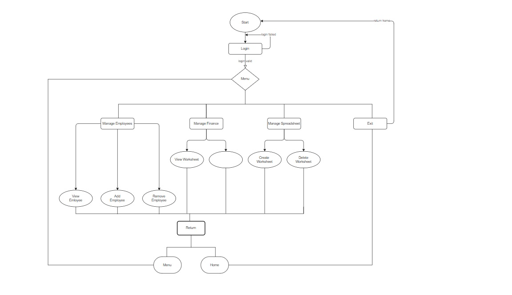
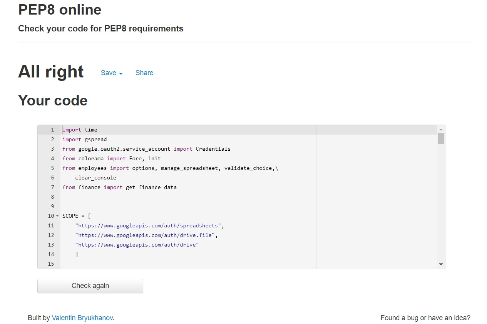
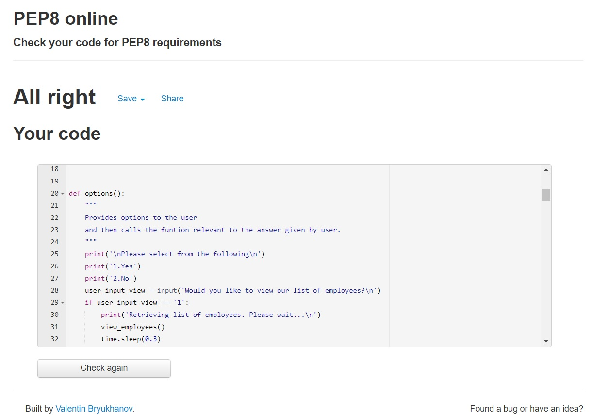
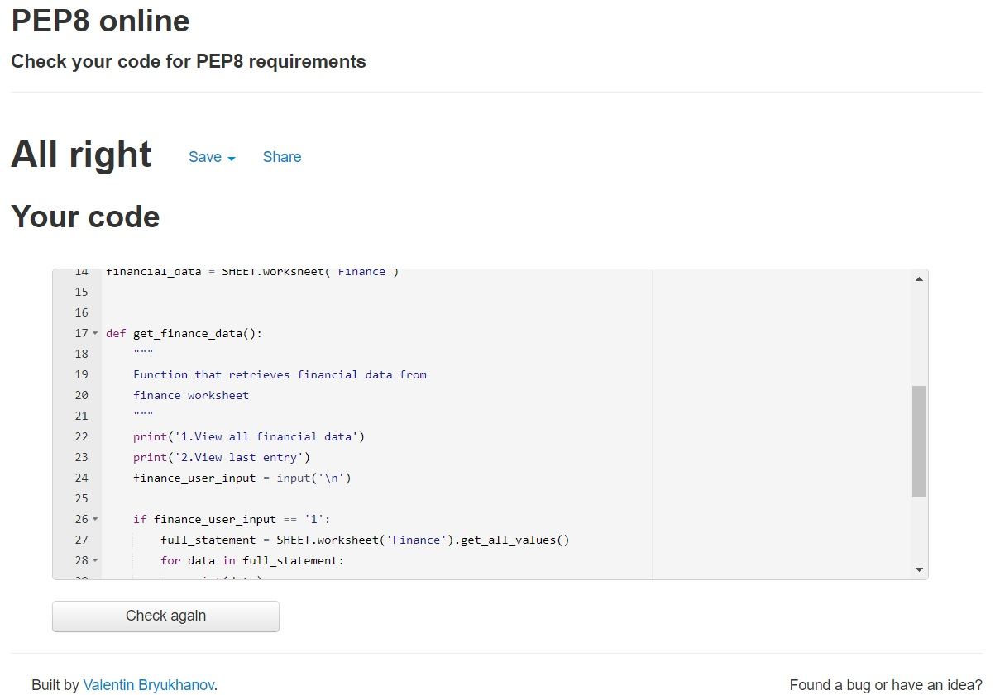

# Tech Company Ltd Database

Developer: Sean Reid

<a href="https://company-data-analysis-app.herokuapp.com/">Live App</a>

## Table of Contents

1. [Project Goals](#project-goals)
    1. [User Goals](#user-goals)
    2. [Site Owner Goals](#site-owner-goals)
2. [User Experience](#user-experience)
    1. [Targeted Audience](#targeted-audience)
    2. [User Requirements and Expectations](#user-requirements-and-expectations)
    3. [User Stories](#user-stories)
3. [Design](#design)
    1. [Flowchart](#flowchart)
    2. [User Manual](#user-manual)
4. [Technologies Used](#technologies-used)
    1. [Languages](#languages)
    2. [Frameworks and Tools](#frameworks-and-tools)
5. [Features](#features)
6. [Testing](#validation)
7. [Bugs](#Bugs)
8. [Deployment](#deployment)
9. [Credits](#credits)
10. [Acknowledgements](#acknowledgements)

## Project Goals

### User Goals

<ul>
<li>User should be able view and change data on the company spreadsheets.</li>
</ul>

### Site Owner Goals

<ul>
<li>I want users to be able to view to the relevant data.</li>
<li>I want users to be able to add and/or remove data.</li>
</ul>

## User Experience

### Targeted Audience

<ul>
<li>Authorised users who need analyse company data for review.</li>
</ul>

### User Requirements and Expectations

<ul>
<li></li>
<li></li>
<li></li>
<li></li>
<li></li>
</ul>

## User Stories

### As A First Time User:

1. As a user I expect the program to be secure.
2. I want to be able register my login credentials.
3. I want to be able to view data on the company spreadsheet.
4. I want to be able to manipulate data on the company spreadsheet.
5. I want to be able to add and remove worksheets.
6. I want to be able retrieve pre-caluculated financial data.
7. 

### As A Returning User:

8. I expect to be able to login using my pre-registered credentials.
9. I expect the program to work the same regardless of browser or device.

### As A Site Owner:

10. I want the program to be well spaced in terms of time managment.
11. I want the program to be protected and require authorisation before it begins.
12. I want users to be able to manipulate spreadsheet data. 
13. I want users to interact with the program hasslefree.
14. I want users to receive error messages and the program to provide solutions.
15. I want the program to loop to the start once users have finished.

### Description

This is an automation designed to view and alter information retrieved from the company's database via spreadsheet.

## Design

### Flowchart

Flowchart

### User Manual

Overview

#### Start

<ul>
<li>The program runs very simply.</li>
<li>Throughout the program you'll mainly be required to answer choose between 2 options.</li>
<li>At the begining you'll be required to login/register.</li>
<li>Once you have successfully logged in you will be redirected to the main menu.</li>
</ul>

#### Main menu

<ul>
<li>You'll be given a choice of 4 options.
<li>Manage employees</li>
<li>Manage Finance</li>
<li>Manage spreadsheet</li>
<li>Exit</li>
</ul>

#### Manage employees

<ul>
<li>This option allows the user manipulate the 'Employess' worksheet.</li>
<li>You can view, add and remove employees from the worksheet.</li>
</ul>

#### Manage Finance

<ul>
<li>This option allows the user to review the data in the financial worksheet.</li>
<li>This data in question represents the income compared to the expenditure.</li>
</ul>

#### Manage Spreadsheet

<ul>
<li>This option allows to create or delete specific worksheets.</li>
</ul>

#### Exit

<ul>
<li>Selecting this option returns the user to the begining.</li>
</ul>

## Technologies Used

### Languages

<ul>
<li>Python</li>
</ul>

### Frameworks and Tools

<ul>
<li></li>
<li>Diagrams.net - Used for flowchart</li>
<li>Git - used for version control within VSCode to push the code to GitHub.</li>
<li>Github - used as a remote repository to store project code</li>
<li>Gitpod</li>
<li>Google Cloud Platform</li>
<li>Google Sheets API</li>
<li>Google Sheets - Used to store spreadsheet data.</li>
<li>Heroku</li>
<li>PEP8</li>
<li>Visual Studio Code - IDE used to write the code for project.</li>
</ul>

#### Libraries

##### Python Libraries

<ul>
<li>time</li>
<li>os</li>
</ul>

##### 3rd Party Libraries

<ul>
<li>gspread</li>
</ul>

## Features

<ul>
<li>At the begining you will be asked to sign in.</li>

Login

<li>As the program begins you will be given a choice on what services you would like to use.</li>

Choices

<li>You can either choose to add, remove, or simply view an employees details for reviewing.</li>

Choices

<li>To to any of these tasks you will need to answer either yes or no to the relevant questions</li>

Choices

<li>Should you choose to add an employee to the database you will have to input their detais</li>

Choices

<li>Once you have entered the employees details, they should appear on the spreadsheet</li>

Choices

<li>To remove an employee you will need to input their details</li>

Choices

<li>Once you have entered the employee details, they should be removed from the spreadsheet.</li>

Choices

<li>To view the employees you need only answer yes to the relvant question.</li>

Choices

<li>If you had answered yes to view employee details, you will be given a full list of existing employees.</li>

Choices

</ul>

## Testing

### Validation

<ul>
<li>Python code was tested via The PEP8 Python Validator.</li>
 

run.py

employees.py

finance.py

</ul>

### Browser Compatibility

The website was tested on the browsers via:
<ul>
<li>Google Chrome</li>
<li>Microsoft Edge</li>
<li>Firefox</li>
</ul>

## User Story Testing

1. As a user I expect the program to be secure.

| **Feature** | **Action** | **Expected Result** | **Actual Result** |
|-------------|------------|---------------------|-------------------|
| Program security | Program requests user to login | User must login before continuing | Works as expected |

2. I want to be able register my login credentials.

| **Feature** | **Action** | **Expected Result** | **Actual Result** |
|-------------|------------|---------------------|-------------------|
| Register new user | Program registers user based on user input | User input updated to 'Login' worksheet | Works as expected |

3. I want to be able to view data on the company spreadsheet.

| **Feature** | **Action** | **Expected Result** | **Actual Result** |
|-------------|------------|---------------------|-------------------|
| View spreadsheet data | Retrieve list of data form worksheets | User receives list of data | Works as expected |

4. I want to be able to add data on the company spreadsheet.

| **Feature** | **Action** | **Expected Result** | **Actual Result** |
|-------------|------------|---------------------|-------------------|
| Add new data to worksheet | User input is appended to worksheet | New data should be appended successfully| Works as expected |

5. I want to be able to remove data on the company spreadsheet.

| **Feature** | **Action** | **Expected Result** | **Actual Result** |
|-------------|------------|---------------------|-------------------|
| Remove data on worksheet | User input is removed from worksheet | Data should be removed from worksheet | Works as expected |

6. I want to be able retrieve pre-caluculated financial data.

| **Feature** | **Action** | **Expected Result** | **Actual Result** |
|-------------|------------|---------------------|-------------------|
| Data should be calculated beforhand | User requsets summary data | User should recieve pre-calculated data |  |

7. 

| **Feature** | **Action** | **Expected Result** | **Actual Result** |
|-------------|------------|---------------------|-------------------|
|  |  |  |  |

8. I expect to be able to login using my pre-registered credentials.

| **Feature** | **Action** | **Expected Result** | **Actual Result** |
|-------------|------------|---------------------|-------------------|
| User login | Program requests user login | User must login before continuing | Works as expected |

9. I expect the program to work the same regardless of browser or device.

| **Feature** | **Action** | **Expected Result** | **Actual Result** |
|-------------|------------|---------------------|-------------------|
| Browser compatibility | Program works on various browsers | Program should work on various browsers | Works as expected |

10. 

| **Feature** | **Action** | **Expected Result** | **Actual Result** |
|-------------|------------|---------------------|-------------------|
|  |  |  |  |

11. I want the program to be protected and require authorisation before it begins.

| **Feature** | **Action** | **Expected Result** | **Actual Result** |
|-------------|------------|---------------------|-------------------|
| Program security | Authorisation required | User must login before proceeding | Works as expected |

12. I want users to be able to manipulate spreadsheet data. 

| **Feature** | **Action** | **Expected Result** | **Actual Result** |
|-------------|------------|---------------------|-------------------|
| Data Manipulation | Data is viewed and edited by user | User can manipulate data at will | works as expected |

13. I want users to interact with the program hasslefree.

| **Feature** | **Action** | **Expected Result** | **Actual Result** |
|-------------|------------|---------------------|-------------------|
| Navigation | Run program | Program should run without complications | Works as expected |

14. I want users to receive error messages and provide solutions.

| **Feature** | **Action** | **Expected Result** | **Actual Result** |
|-------------|------------|---------------------|-------------------|
| Error messages | Enter invalid input | Raise error and provide solution | Works as expected |

15. I want the program to loop to the start once users have finished.

| **Feature** | **Action** | **Expected Result** | **Actual Result** |
|-------------|------------|---------------------|-------------------|
| Return options | Select appropriate option | Return to home | Works as expected |

## Bugs

| **Bugs** | **Fixes** |
| -------- | --------- |
| Every time the view_employees function is called it deletes a row.  | Remove delete_row gspread method from function. |
| For loop in go back function disrupted the program. | Remove for loop from go back function |
|  |  |

## Deployment

<ul>
<li>Within the terminal of your workspace enter:"pip3 freeze > requirements.txt".</li>
<li>Commit and push these changes.</li>
<li>Go to the Heroku website and login/create an account.</li>
<li>Click on the create app button and give it a name. </li>
<li>Select a region and then click on the create app button.</li>
<li>Locate and select the "Settings" tab.</li>
<li>Locate the "Config Vars" button.</li>
<li>In the "KEY" textbox, type in "CREDS"</li>
<li>Return to your workspace and copy all the code on the "creds.json" file.</li>
<li>Return to your heroku page.</li>
<li>In the Value textbox of "Config Vars" paste the code from your "creds.json" file and save.</li>
<li>Next scroll down to buildpacks and select "Add buildpack</li>
<li>Select and save "Python" and "Nodejs" respectively.</li>
<li>Return to the top and select the "Deploy" tab.</li>
<li>Select "Connect to Github" and then search for you repository.</li>
<li>Next scroll down and select the "Deploy branch" button and wait a few minutes.</li>
<li>Select view and yoiu will be redirected to your app.</li>
</ul>

## Credits

### Code Institute

<ul>
<li>Template used was the Code Institute python essentials template.</li>
</ul>

## Acknowledgements

 <ul>
 <li>I'd like to thank My mentor Mo Shami for his excellent mentorship.</li>
 <li>I'd also like to thank the Code Institute staff for their continued support.</li>
 </ul>

 [Return To Top](#Tech-Company-Ltd-Database)